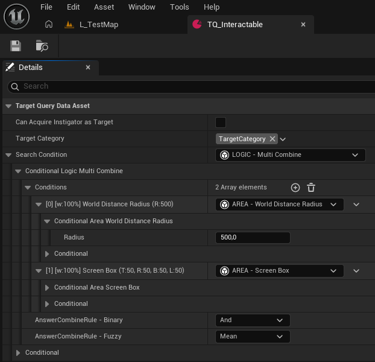
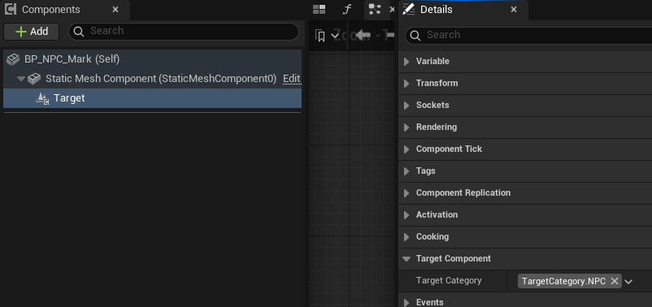
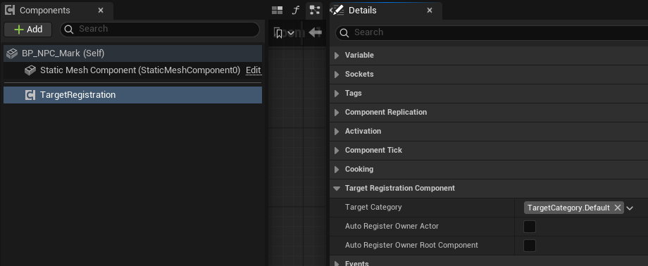
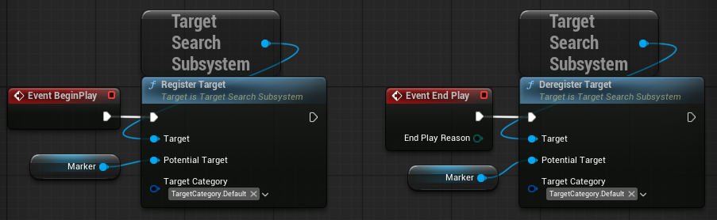
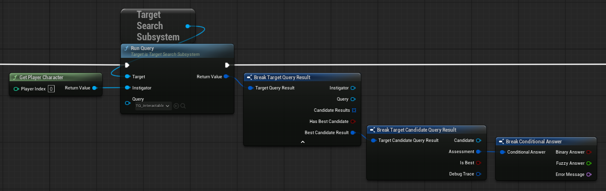
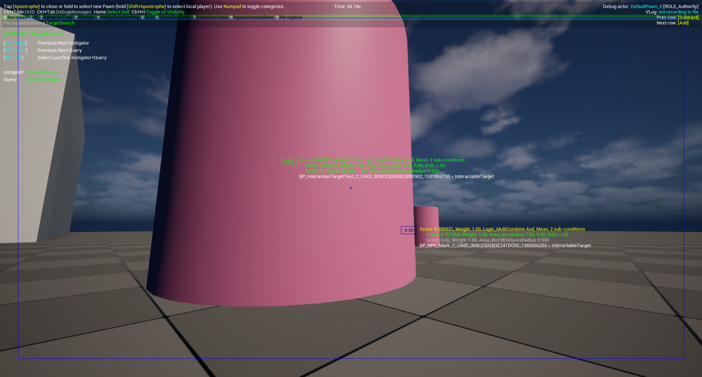

## Unreal Target Search

## Concept

Adds a `SF::UTargetQueryDataAsset` asset type, which allows designers to easily configure complex,
reusable routines to search an object in the world. 

Queries can be evaluated and yield a comprehensive result, including a score for each considered
candidate. Target candidates need to register themselves proactively, for example via the 
`SF::UTargetComponent`.

Target queries rely on the `SFConditional` plugin for defining the scoring routine per query and this
inherit their benefits like openess for extension, hierarchical composition and gameplay debugger
integration.

> This is basically an implementation of the target search system Double Fine implemented and presented in this blog post:
<a href="https://www.doublefine.com/news/devin-target-search">Behind The Code: Locked On Target</a>.

> Requires the <a href="https://github.com/Strayfarer/SFConditional">SFConditional</a> plugin.

## Table Of Contents

* [Supported Engine Version](#supported-engine-version)
* [Installation](#installation)
* [Development Status](#development-status)
* [Usage](#usage)
    * [Author Target Query](#author-target-query)
    * [Registering Targets](#registering-targets)
    * [Evaluate Target Query](#evaluate-target-query)
    * [Gameplay Debugger Integration](#gameplay-debugger-integration)

## Supported Engine Version

The plugin was developed for Unreal Engine 5.5+, though it should work for all 5.X versions.

## Installation

The best way is to clone this repository as a submodule; that way you can contribute
pull requests if you want and more importantly, easily get latest updates.
The project should be placed in your project's `Plugins` folder.

```
> cd YourProject
> git submodule add https://github.com/Strayfarer/SFTargetSearch
> git add ../.gitmodules
> git commit
```

Alternatively you can download the ZIP of this repo and place it in
`YourProject/Plugins/`.

## Development Status

This plugin is currently in an experimental state. As of publishing, there are no known bugs. Included are
quality of life features such as Blueprint, Gameplay Debugger and data validation support.
It hasn't been battle-tested by me in a full-on production yet, but it got iterated already
during a few of my private projects.

Feel free to open new issues in the GitHub issues tab.
Any general feedback and pull-requests are much appreciated!

## Usage

### Author Target Query

To configure a Target Query, in your content browser add a new data asset of class `UTargetQueryDataAsset`,
name, and open it.

Setting `CanAcquireInstigatorAsTarget` to true will allow the instigator of the query as target candidate.
Who the instigator is, is determined by the code running the query. Typically this is the game's avatar representation
which you don't want as a target.

Use `TargetCategory` in conjunction with the `TargetCategory` set on targets to allow the system quick filtering
of candidates without evaluating the (potentially expensive) search condition.

The `SearchCondition` is the core of the query: from all candidates passing the binary answer of the query
the one with the highest fuzzy score is selected as best candidate during evaluation. See the 
<a href="https://github.com/Strayfarer/SFConditional">SFConditional GitHub Repository</a> for an in-depth
how-to on conditional setup.

The example below showcases a setup for an interactable target query.

[<p align="center"></p>](./Docs/TargetQuerySetup.png)

### Registering Targets

As target candidates need to be registered proactively to the target registry, some setup is needed for them.

In order to mark an actor as target at a specific relative point to the actor origin, 
you can use the scene component `SF::UTargetComponent`, which will register itself:

[<p align="center"></p>](./Docs/TargetComponent.png)

For the common use case of registering an actor as target, you can use the `SF::UTargetRegistrationComponent`
and check `AutoRegisterOwnerActor`:

[<p align="center"></p>](./Docs/TargetRegistrationComponent.png)

You can also register targets manually:
[<p align="center"></p>](./Docs/ManualRegistration.png)
```C++
SF::UTargetSearchSubsystem::Get(*this).RegisterTarget(Marker, TAG_TARGETCATEGORY_Default);
SF::UTargetSearchSubsystem::Get(*this).DeregisterTarget(Marker, TAG_TARGETCATEGORY_Default);
```

### Evaluate Target Query

After having done the setup above, you can evaluate the target query by fetching the target search subsystem and
calling `RunQuery(..)` with the target query and your desired instigator as arguments:

[<p align="center"></p>](./Docs/Evaluate.png)
```C++
const SF::FTargetQueryResult Result = 
    SF::UTargetSearchSubsystem::Get(*this)
    .RunQuery(QueryAsset, Instigator);
```

The returned `SF::FTargetQueryResult` holds
- information about the query run arguments
- a list of all candidates and how they fared (binary + fuzzy score)
- the best candidate, if there was one

### Gameplay Debugger Integration

The plugin comes with a handy gameplay debugger category which allows browsing through all latest query runs per
query asset and instigator:

[<p align="center"></p>](./Docs/GameplayDebugger.png)

In top left is the controls overview for cycling through query assets and instigators.

Attached to each target candidate in screen space is information about the evaluation result for the candidate.
To the left there's the overall score (in green for the best candidate), to the right there's a listing of how the 
candidate fared against each conditional in the search condition tree of the query.

Some conditionals additionally draw debug shapes. In this case the screen box conditional draws a blue box
on the screen.
